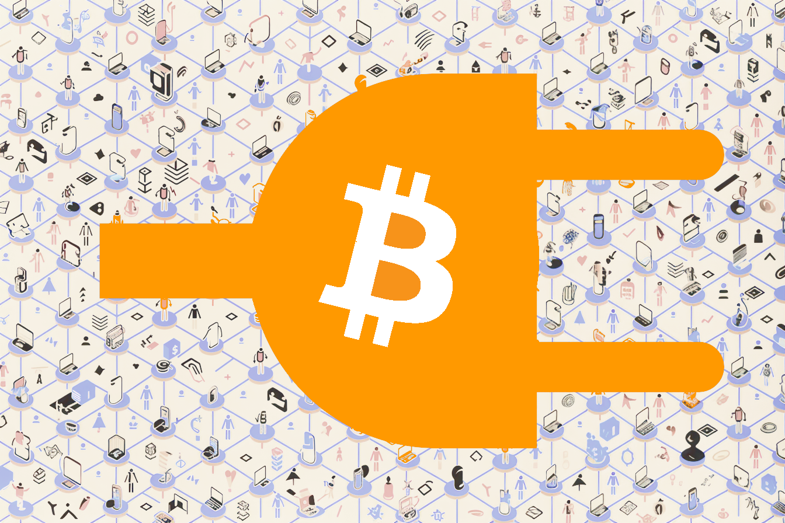

# APIBTC: Unlock Instant Bitcoin Payments for Your AI & Apps

<div style="display: flex; gap: 10px; height: 18px;">
  <a href="https://pypi.org/project/apibtc/">
    
  </a>
  <a href="https://www.npmjs.com/package/@thehyperlabs/apibtc">
    
  </a>
  <a href="https://www.nuget.org/packages/ApiBtc.Client">
    
  </a>
  <a href="https://github.com/DontTrustVerifyOrg/apibtc/blob/main/LICENSE">
    
  </a>
</div>



**Effortlessly weave the power of the Bitcoin Lightning Network into your AI agents, applications, and automated services using elegantly simple Python and JavaScript APIs.**

---

## Unleash the Power of Programmable Money

The Bitcoin Lightning Network represents a paradigm shift: near-instant, low-fee Bitcoin transactions at scale. But harnessing this power often involves navigating complex protocols, channel management, and node operations.

**APIBTC is your streamlined gateway.** We abstract the intricate details, providing clean, developer-centric interfaces so you can focus on innovation, not infrastructure. Integrate programmable Bitcoin payments to:

*   🚀 **Supercharge AI Agents:** Grant your autonomous agents the ability to transact directly – paying for APIs, accessing premium data streams, or interacting with other agents on a value-for-value basis.
*   💰 **Monetize Effortlessly:** Accept instant Bitcoin payments for your SaaS, APIs, digital content, or any service, opening up global, censorship-resistant revenue streams.
*   💡 **Build the Future:** Pioneer novel applications in DeFi, gaming, IoT micropayments, creator economies, and automated systems where instant value transfer is key.

---

## Why Developers Choose APIBTC

We built APIBTC with the developer experience as our top priority. Here’s what sets it apart:

*   ⚡ **Truly Instant Payments:** Tap into the Lightning Network's sub-second settlement times and negligible fees. Perfect for micropayments and high-throughput scenarios where traditional finance lags behind.
*   🤖 **Designed for Automation:** Minimal, predictable functions make integrating payments into complex AI logic, scripts, or backend services a breeze. Think `addinvoice()`, `sendpayment()`, `getinvoice()`. Simple.
*   💻 **Fluent in Your Language:** Get native, idiomatic libraries for Python and JavaScript – the dominant languages in AI, machine learning, and web development. No awkward wrappers, just clean code.
*   🚀 **One-Click Deployment:** Get the full stack running instantly with a single Docker container. No complex setup, no dependency management – just pull the image and you're ready to build.
*   🔑 **Truly Permissionless:** No account creation, no KYC, no approval process. Simply generate a private key locally and start using the API immediately. True to Bitcoin's core principles.
*   🌐 **Transparent & Community-Driven:** As fully open-source software ([Apache 2.0 Licensed](https://github.com/DontTrustVerifyOrg/apibtc/blob/main/LICENSE)), you have complete visibility. Inspect the code, contribute improvements, and join a community building the future of Bitcoin integration.

---

## Imagine the Possibilities...

APIBTC isn't just a library; it's an enabler for groundbreaking ideas:

*   **Autonomous AI Researchers:** Picture an AI agent dynamically purchasing specialized compute time on decentralized networks or paying for exclusive datasets – all via seamless Lightning transactions.
*   **Micropayment-Powered Media:** Content creators finally escaping ad-dependency, receiving satoshis instantly per article view, video watch, or podcast listen.
*   **Self-Sustaining IoT:** Smart devices autonomously paying for their own bandwidth, data storage, or critical firmware updates using earned or allocated Bitcoin.
*   **High-Frequency Trading Bots:** Automated systems settling trades or paying for real-time data feeds directly over Lightning, minimizing counterparty risk and delays.
*   **Usage-Based API Billing:** Offering your API with granular, pay-as-you-go pricing, settled instantly without costly payment processor overhead.

---

## Advanced Features: HODL Invoices

APIBTC now supports HODL invoices, a powerful feature that enables escrow-like functionalities in the Lightning Network.

**What are HODL Invoices?**

HODL invoices allow for conditional payments where funds are locked until a specific condition is met. Unlike standard invoices that settle immediately, HODL invoices remain in a pending state until explicitly settled with a preimage.

**Key Benefits:**
* **Escrow Capabilities:** Create trustless escrow arrangements where funds are only released when predefined conditions are met.
* **Conditional Payments:** Enable payments that only complete when a specific action occurs or verification is provided.
* **Enhanced Security:** Add an additional layer of protection for high-value transactions or complex payment scenarios.

**How It Works:**
1. The recipient creates a HODL invoice with a random or specific hash
2. The payer sends payment to the HODL invoice
3. Funds remain locked (but committed) until the recipient reveals the preimage
4. The recipient settles the invoice by providing the preimage through the SettleInvoice method

**Use Cases:**
* **Marketplace Escrow:** Hold buyer funds until seller confirms shipment or delivery
* **Service Completion Verification:** Release payment only when a service is confirmed complete
* **Multi-stage Transactions:** Enable complex payment flows requiring verification steps
* **Atomic Swaps:** Facilitate cross-chain cryptocurrency exchanges

---

**API Documentation**

APIBTC provides comprehensive API documentation through [Swagger](https://regtest.apibtc.org/apibtc/swagger/index.html).

**Important Notice:** The API documentation and testing environment operates on Bitcoin's regtest network.

**What is Regtest?**

Regtest (Regression Test Mode) is a local testing environment where developers can create blocks on demand, control the network conditions, and test Bitcoin applications without using real Bitcoin. It's completely isolated from the mainnet and testnet networks.

**⚠️ Warning: Do not send real Bitcoin to any addresses generated in this environment!**

Any real Bitcoin sent to regtest addresses will be lost permanently. The regtest environment is designed exclusively for development and testing purposes.

**Using the Swagger Documentation**

The Swagger UI provides:
* Interactive documentation for all API endpoints
* The ability to test API calls directly from your browser
* Request and response examples
* Parameter descriptions and requirements
* Authentication information

This makes it easy to understand the API capabilities before implementing them in your code.

---

## See APIBTC in Action: AI Agent Demo

Watch how an AI agent can seamlessly interact with the Bitcoin Lightning Network using APIBTC:

<video width="100%" controls>
  <source src="./static/videos/agent.mp4" type="video/mp4">
  Your browser does not support the video tag.
</video>

This demonstration showcases how AI agents can autonomously create invoices, process payments, and interact with the Lightning Network - all through the simple and intuitive APIBTC interface.

---

## Launch in Minutes: Your First Lightning Integration

Getting started with APIBTC is incredibly straightforward. Follow these simple steps to integrate Lightning payments into your project.

### 1. Install the Library

Grab the package using your environment's standard tool:

```bash
# For Python environments
pip install apibtc

# For Node.js / JavaScript environments
npm install @thehyperlabs/apibtc

# For .NET environments
dotnet add package ApiBtc.Client
```

### 2. Initialize and Interact

Once installed, initialize the client with your credentials and start interacting with the Lightning Network. Here’s a taste:

<!-- **Python Example:** -->
<details>
  <summary>
    <strong>Python Example</strong>
  </summary>

  <pre>
    <code>
      from apibtc import Wallet
      from mnemonic import Mnemonic
      from bip32utils import BIP32Key

      # Declare API url
      BASE_URL = "API_BASE_URL"

      # Create two wallets
      # Wallet 1 - Invoice Creator
      mnemon1 = Mnemonic('english')
      words1 = mnemon1.generate(128)
      private_key1 = BIP32Key.fromEntropy(mnemon1.to_seed(words1)).PrivateKey().hex()
      wallet1 = Wallet(base_url=BASE_URL, privkey=private_key1)

      # Wallet 2 - Invoice Payer
      mnemon2 = Mnemonic('english')
      words2 = mnemon2.generate(128)
      private_key2 = BIP32Key.fromEntropy(mnemon2.to_seed(words2)).PrivateKey().hex()
      wallet2 = Wallet(base_url=BASE_URL, privkey=private_key2)

      # Payment flow
      # Create invoice with wallet1
      invoice = wallet1.addinvoice(satoshis=1000, memo="Payment from wallet2", expiry=3600)

      # Pay invoice with wallet2
      wallet2.sendpayment(paymentrequest=invoice['payment_request'], timeout=30, feelimit=100)

      # Check balances after payment
      print("Wallet1 balance:", wallet1.getbalance())
      print("Wallet2 balance:", wallet2.getbalance())
    </code>
  </pre>
</details>

<details>
  <summary>
    <strong>JavaScript Example</strong>
  </summary>
  <pre>
    <code>
      const { Wallet } = require('@thehyperlabs/apibtc');
      const bip39 = require('bip39');
      const hdkey = require('hdkey');

      // Declare API url
      const BASE_URL = "API_BASE_URL";

      // Create two wallets
      // Wallet 1 - Invoice Creator
      const mnemonic1 = bip39.generateMnemonic(128);
      const seed1 = bip39.mnemonicToSeedSync(mnemonic1);
      const privateKey1 = hdkey.fromMasterSeed(seed1).privateKey.toString('hex');
      const wallet1 = new Wallet(BASE_URL, privateKey1);

      // Wallet 2 - Invoice Payer
      const mnemonic2 = bip39.generateMnemonic(128);
      const seed2 = bip39.mnemonicToSeedSync(mnemonic2);
      const privateKey2 = hdkey.fromMasterSeed(seed2).privateKey.toString('hex');
      const wallet2 = new Wallet(BASE_URL, privateKey2);

      // Payment flow
      // Create invoice with wallet1
      const invoice = await wallet1.addinvoice(1000, "Payment from wallet2", 3600);
      
      // Pay invoice with wallet2
      await wallet2.sendpayment(invoice.paymentRequest, 30, 100);
      
      // Check balances after payment
      console.log("Wallet1 balance:", await wallet1.getbalance());
      console.log("Wallet2 balance:", await wallet2.getbalance());
    </code>
  </pre>
</details>

<details>
  <summary>
    <strong>C# Example</strong>
  </summary>
  <pre>
    <code>
      using System;
      using NBitcoin;
      using ApiBtc.Client;

      class Program
      {
          static void Main()
          {
              // Declare API url
              const string BASE_URL = "API_BASE_URL";
              
              // Create two wallets
              // Wallet 1 - Invoice Creator
              Mnemonic mnemonic1 = new Mnemonic(Wordlist.English, WordCount.Twelve);
              ExtKey hdRoot1 = mnemonic1.DeriveExtKey();
              string privateKey1 = hdRoot1.PrivateKey.ToHex();
              var wallet1 = new Wallet(BASE_URL, privateKey1);
              
              // Wallet 2 - Invoice Payer
              Mnemonic mnemonic2 = new Mnemonic(Wordlist.English, WordCount.Twelve);
              ExtKey hdRoot2 = mnemonic2.DeriveExtKey();
              string privateKey2 = hdRoot2.PrivateKey.ToHex();
              var wallet2 = new Wallet(BASE_URL, privateKey2);
              
              // Payment flow
              // Create invoice with wallet1
              var invoice = await wallet1.AddInvoice(1000, "Payment from wallet2", 3600);
              
              // Pay invoice with wallet2
              await wallet2.SendPayment(invoice.PaymentRequest, 30, 100);
              
              // Check balances after payment
              Console.WriteLine($"Wallet1 balance: {await wallet1.GetBalance()}");
              Console.WriteLine($"Wallet2 balance: {await wallet2.GetBalance()}");
          }
      }
    </code>
  </pre>
</details>

---

## Shape the Future: Contribute to APIBTC

APIBTC thrives on community collaboration. Whether you're fixing a typo, improving documentation, tackling a bug, or implementing a new feature, your contributions are valuable and welcome!

1.  **Find an Issue:** Check the [issue tracker](https://github.com/DontTrustVerifyOrg/apibtc/issues) for open tasks or propose your own enhancement.
2.  **Fork & Code:** Fork the repository, create your feature branch, and start coding!
3.  **Submit a Pull Request:** Once ready, submit a PR for review.

Let's build the best Bitcoin Lightning integration tool together! Visit the [APIBTC GitHub Repository](https://github.com/DontTrustVerifyOrg/apibtc) to get involved.

---
<!-- GitHub Star Button - Encourage engagement -->
<div style="margin-top: 1.5rem; margin-bottom: 2rem; text-align: center;"> <!-- Center the button -->
  <p><strong>Like APIBTC? Give us a star on GitHub!</strong></p>
  <a class="github-button" href="https://github.com/DontTrustVerifyOrg/apibtc" data-icon="octicon-star" data-size="large" data-show-count="true" aria-label="Star DontTrustVerifyOrg/apibtc on GitHub">Star</a>
</div>

<!-- GitHub Corner -->
<a href="https://github.com/DontTrustVerifyOrg/apibtc" class="github-corner" aria-label="View source on GitHub"><svg width="80" height="80" viewBox="0 0 250 250" style="fill:#151513; color:#fff; position: absolute; top: 0; border: 0; right: 0;" aria-hidden="true"><path d="M0,0 L115,115 L130,115 L142,142 L250,250 L250,0 Z"></path><path d="M128.3,109.0 C113.8,99.7 119.0,89.6 119.0,89.6 C122.0,82.7 120.5,78.6 120.5,78.6 C119.2,72.0 123.4,76.3 123.4,76.3 C127.3,80.9 125.5,87.3 125.5,87.3 C122.9,97.6 130.6,101.9 134.4,103.2" fill="currentColor" style="transform-origin: 130px 106px;" class="octo-arm"></path><path d="M115.0,115.0 C114.9,115.1 118.7,116.5 119.8,115.4 L133.7,101.6 C136.9,99.2 139.9,98.4 142.2,98.6 C133.8,88.0 127.5,74.4 143.8,58.0 C148.5,53.4 154.0,51.2 159.7,51.0 C160.3,49.4 163.2,43.6 171.4,40.1 C171.4,40.1 176.1,42.5 178.8,56.2 C183.1,58.6 187.2,61.8 190.9,65.4 C194.5,69.0 197.7,73.2 200.1,77.6 C213.8,80.2 216.3,84.9 216.3,84.9 C212.7,93.1 206.9,96.0 205.4,96.6 C205.1,102.4 203.0,107.8 198.3,112.5 C181.9,128.9 168.3,122.5 157.7,114.1 C157.9,116.9 156.7,120.9 152.7,124.9 L141.0,136.5 C139.8,137.7 141.6,141.9 141.8,141.8 Z" fill="currentColor" class="octo-body"></path></svg></a><style>.github-corner:hover .octo-arm{animation:octocat-wave 560ms ease-in-out}@keyframes octocat-wave{0%,100%{transform:rotate(0)}20%,60%{transform:rotate(-25deg)}40%,80%{transform:rotate(10deg)}}@media (max-width:500px){.github-corner:hover .octo-arm{animation:none}.github-corner .octo-arm{animation:octocat-wave 560ms ease-in-out}}</style>

<!-- GitHub Buttons Script -->
<script async defer src="https://buttons.github.io/buttons.js"></script>