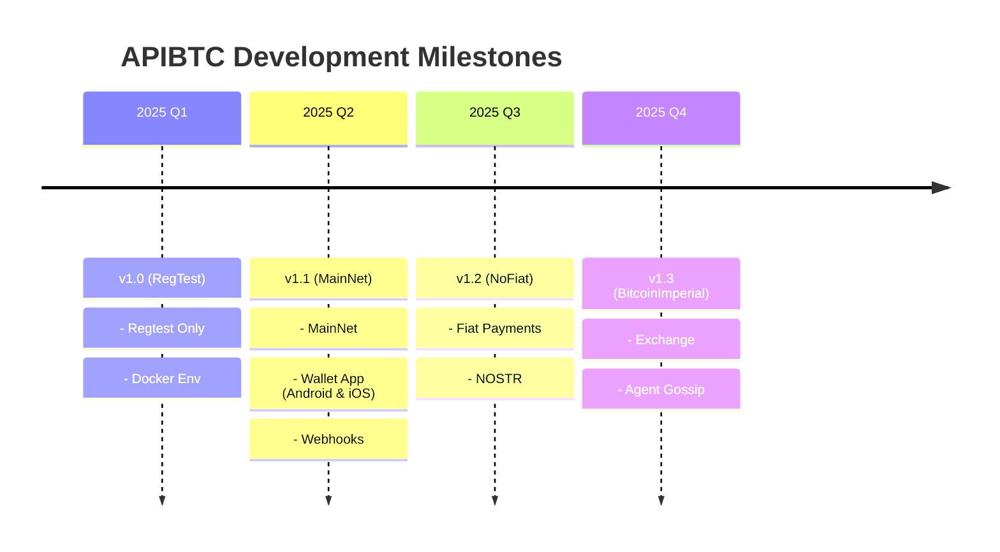

# APIBTC Development Milestones

## 2025 Q1 — v1.0 (RegTest)
- **RegTest-Only Version**:  
  The initial release focuses exclusively on Bitcoin Regtest mode, allowing developers to simulate Bitcoin transactions without using real funds.
- **Docker Environment**:  
  A ready-to-use Docker setup is provided, making it easy for developers to spin up a full local testing environment with minimal configuration.

---

## 2025 Q2 — v1.1 (MainNet)
- **MainNet Support**:  
  APIBTC moves from RegTest to full Bitcoin MainNet compatibility, enabling real-world Bitcoin Lightning payments.
- **Wallet App (Android & iOS)**:  
  Launch of a lightweight mobile wallet application designed for APIBTC interactions, available on both Android and iOS platforms.  
  This makes it easy for users and AI agents to receive and manage Bitcoin payments directly.
- **Webhooks for Payment Events**:  
  Addition of webhook support for real-time notifications of payment and event updates, making integration with other apps and workflows seamless.

---

## 2025 Q3 — v1.2 (NoFiat)
- **Fiat Payments Integration**:  
  Support for optional fiat payment channels, enabling users to accept both Bitcoin and traditional currency payments through the API.
- **NOSTR Integration**:  
  Native integration with the NOSTR decentralized network, allowing payment metadata, receipts, and messages to be broadcast in a censorship-resistant way.

---

## 2025 Q4 — v1.3 (Bitcoin-Imperial)
- **Exchange Module**:  
  Introduction of a exchange feature, allowing Bitcoin-to-fiat swaps inside APIBTC.
- **Agent Gossip Protocol**:  
  Launch of the "Agent Gossip" feature — a decentralized reputation and messaging system for AI agents and users, leveraging Bitcoin and NOSTR principles for coordination without trusted intermediaries.

